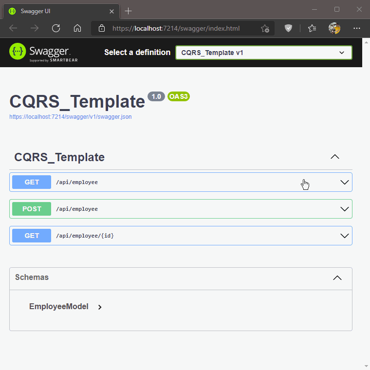

# «Basic implementation of the **CQRS** architectural pattern»

#### In this solution demos the fundamental principles of segregating functions into **commands** and **queries**.
##
> **As per microservice minimalism rules all Web API functionality has been completely transferred to the ```Program.cs``` file and converted to a minimal-API (conventional controller isn't used here).**
> **The repository abstracts the data layer functionality supported by ```SQL Server```.**
> **For simplicity, a common data model is used in violation of the requirement to separate models for commands and queries.**

### Demonstration:


