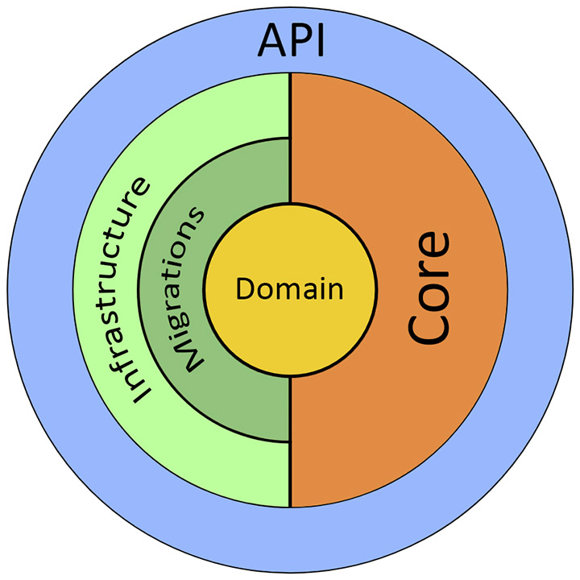

# Sample Solution with Clean Architecture

### About project:

This sample is a boilerplate template project to demonstrate building ASP.NET Core (.NET 6) Web API following Clean Architecture.

### Onion-architecture scheme:

### Solution structure:

### Built with:

##### Back-end
 - ASP.NET Core (.NET 6) Web API
 - Entity Framework Core (EF Core 6)
 - SQL Server

##### Front-end
 - SwaggerUI

### Prerequisites:

###### Make sure you are running on the latest [.NET 6 SDK](https://dotnet.microsoft.com/download/dotnet/6.0) (SDK 6.0.100 and above only)
###### [Visual Studio 2022](https://visualstudio.microsoft.com/vs/) (v17.0+)

### Features included:

* Minimal-API
* Native **CQRS** & **Mediator** patterns with commands/queries without MediatR or equivalent libraries with very weak abstraction and limited features similar to those that don't subdivide processing pipelines into commands and queries necessary for specific aspects:
  * Audit logging for commands only
  * Caching for queries only
  * Configuring unit of work to read-only behavior for queries only and, conversely, to write-only behavior for commands only
* Improving **CQRS**:
  * Batch registration in DI container for generic interface implementations
* DTO models mapping
* Fluent validation
* Caching
* Logging
* Exception handling

### Show your support:

I really hope this solution helps developers get started on building awesome things with ASP.NET Core (.NET 6) Web API. 

Found this solution helpful and useful? You can do these to help this reach greater audience.

1. Leave a star on this repository. :star:
2. Recommend this solution to your colleagues and dev community.
3. Join my [Twitter](https://twitter.com/alexanderusov). I regularly post interesting news over there.
4. Follow my [GitHub](https://github.com/sharpist). I regularly share great content over there as well.
5. You can also buy me [a cup of great coffee](https://www.buymeacoffee.com/sharpist)! :coffee:

